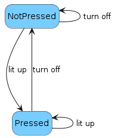

# Introduction

<!-- Provide a single sentence or a short paragraph describing the module's purpose. When using the documentation inside repository, add link to the README and vice versa - link the README to this documentation. -->

This module serves as an example for module maintainers to implement their own modules outside reserved range of modules and does not serve any role in the production environment. For usage of this module, see the [README](../README.md).

# Identification and supported devices

<!-- Provide a list of supported devices and their identification. -->

The module number/ID: `1000`.

## Devices

| **Device Name** | **Device Type** | **Device Roles** | Comment                                     |
| --------------- | --------------- | ---------------- | ------------------------------------------- |
| button1         | 0               | test             | Button driving a state of a dedicated LED   |
| button1         | 10              | test             | Button driving a state of a dedicated LED   |
| button2         | 0               | test2            | Button driving a state of a dedicated LED   |


# Messages

<!-- Describe all types of messages handled by the module (including status, status error and command). For each type, describe the message contents, structure and example of the message. -->

## Status

Each device (button) expects a status message containing a single key `pressed` with a boolean value indicating whether the button is pressed.

### Example

``` json
{
    "pressed": true
}
```
## Status Error

Status errors are not defined for this module.

## Command

Each device (button) expects a command message containing a single key `lit_up` with a boolean value indicating whether the LED should be lit up.

### Example

``` json
{
    "lit_up": true
}
```

# Details of supported devices

<!-- In this section, list all supported devices. Describe their purpose on the car and their behavior relevant to the application accessing the devices through the module. This includes mainly

- the device state machine,
- how the status machine reflects the state machine's state,
- how the state is affected by the received command.

-->

## Button

Button is a simple button device which has one LED attached to it. As status, it sends JSON with key `"pressed"` indicating whether button is pressed. As command, it expects JSON with key `"lit_up"` indicating the desired state of internal LED.

See the state transition diagram below:


